Making a Simple Package for Cuis
================================

This is a tutorial which shows in detail the process of creating a simple package in Cuis Smalltalk and making it sharable on GitHub.

### Basic Orientation

It would be good for you to read through the Cuis documentation on package based code sharing before going through this tutorial.

You can find information at the web site or from within a running Cuis image.

From the Cuis-Smalltalk-Dev web site:

- https://github.com/Cuis-Smalltalk/Cuis-Smalltalk-Dev/blob/master/Documentation/CuisAndGitHub.md
- https://github.com/Cuis-Smalltalk/Cuis-Smalltalk-Dev/blob/master/Documentation/CodeManagementInCuis.md

Within a running Cuis image, use Cmd-Click (the Command key depends on your Operating System) to get the World Menu.  Then open the pages from the Help submenu.

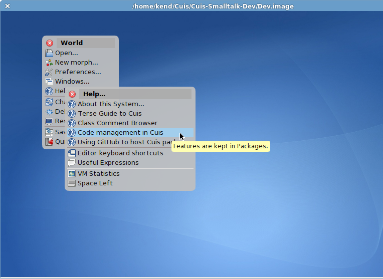`

We will be following the recipies for developing with packages.

The first step in developing a package is to get yourself an account on GitHub
- https://github.com

This step is not shown.

When you have an account, creating a new repository is easy.

We like easy.  We can deal with easy.  ;^)

### Creating a GitHub Repository

The first thing is to think of a good, descriptive-but-not-too-long name.

The convention for Cuis is to start all repository names with 'Cuis-Smalltalk-'.  This allows tools to have a common searching convention for finding packages.

Note that I am creating a repository in Cuis-Smalltalk-Learners.  You will want to create a repository within your own GitHub account.

Shareable Cuis code by convention uses the MIT open source licence.

I typically create a default README.md file as well.

OK.  Now that I have a repository set up, I can clone it and add files.

I am a Linux user, so I use the command line.

Being lazy, I "Copy" the github name from the web page.

I can now "git clone", paste the name, and get a local copy of my shiny new repository.

### Add a new file to a Git repository

For this tutorial I wanted an example where a small amount of code gives useful tool.

I have been thinking of rewriting one of my earliest Cuis projects which I think fits this goal: an Interlingua<->English word lookup.

This is how this current lookup window appears:

The way this works is

- Enter a word, or part of a word. 
- Either press <enter> or click on one of the four buttons.

Pressing enter (carriage return) is the same as clicking on button labeled  'Interlingua Contains'.

Having decided this, the first thing I did was add the Interlingua->English dictionary to the local Git repository.

- [1] copy the file into the local repository
- [2] "git add" to make the repository aware of the file
- [3] "git commit" to declare the file as ready for update
- [4] "git push" to actually update the repository on GitHub from the local version.

Here is what this looks like in a Linux shell:

I can check this by refreshing the repository web page.

### Creating a Cuis Category

OK.  Now for the fun part: some Smalltalk code!

First we need a code Browser. 

Command-Click on the World background to get a World Menu.

 World->Open..->Browser

The upper left _pane_ in the Browser lists class categories.

We want to add a new class category.  Cmd-Click on this pane to gets it's context menu and select 'add item..'

Now we can create a category 'IA-EN-Dictionary'.  

As you might suspect, the international language code for English is 'EN' and the code for Interlingua is 'IA'.

### Adding a Class

We will be creating a specialized SystemWindow with its associated data _model_.

This is a common pattern.  If you open a HierarchyBrowser on 'SystemWindow' you will see this a lot. (Not shown here; you can look later).

Since our dictionary will work in both directions, Interlingua->English and English->Interlingua, we will NOT be using a Smalltalk dictionary here but  it directly from Object.

The class will be called `IEDict`.

We add a Class Variable, `DictData`, to hold our (what else?) dictionary data.  Note that _class variable_ names are by convention capitalized.  This helps distinguish then from _instance variables_.

Access to a class variable is shared by all instances of that class.  An instance variable is unique to each instance of the class.

It is a bit subtle, but there is a thin red border around the lower pane where we typed in the `IEDict` definition fields.  This means that we have started an edit, but not yet saved it.

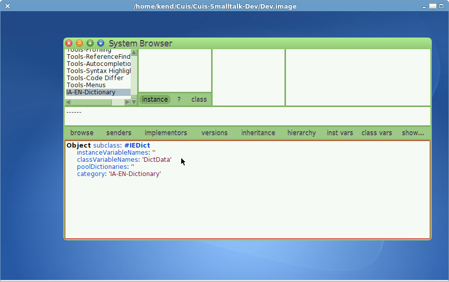

The code you are looking at is just code.  It is text which will be compiled and the compiled code then invoked to create a new Smalltalk class.

Cmd-click on this pane to see the context menu.  We can select 'Accept (s)'.  

If we did not wish to use the menu, we could just type Cmd-s (hold down the command key and press 's').  This is why the '(s)' in 'Accept (s)'.

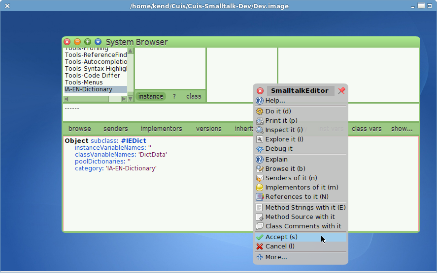

Congratulations!  You have created a new Class!

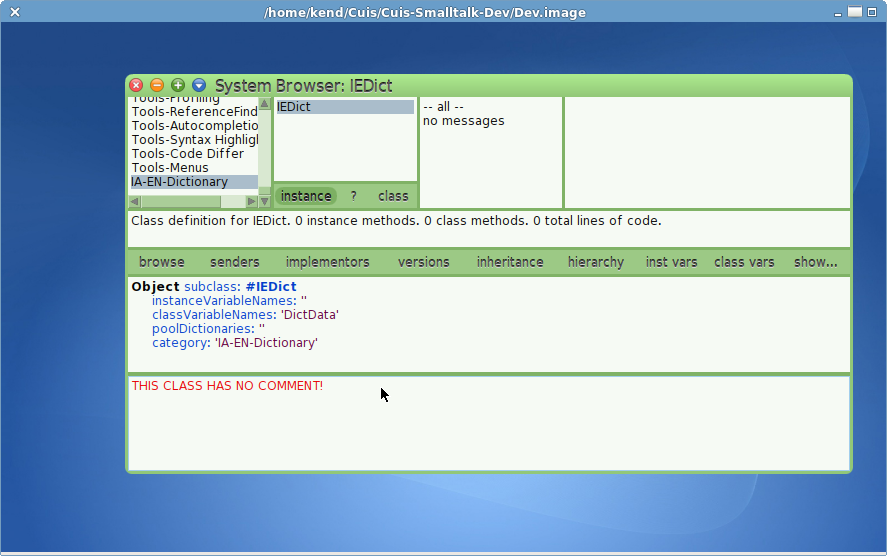

### Add a Class Comment

Noting the red 'THIS CLASS HAS NO COMMENT!', now is a good time to add some description of the new class.

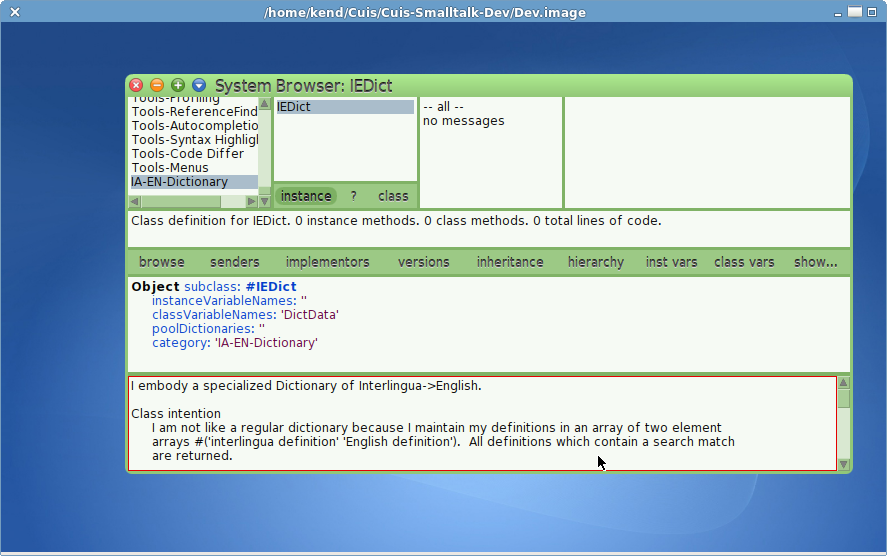

To (s)ave the class comment, I type Cmd-s (or use the context menu selection Accept).

### Creating a Package and adding it to GitHub.

OK.  We have an IEDict class and are about to start adding Smalltalk code.

But this is a perfect time to pause and save our work to GitHub.

The first thing to do is to create a Package which can be added to our GitHub  repository.

I open an Installed Packages browser from the World Menu -> Open.. submenu.

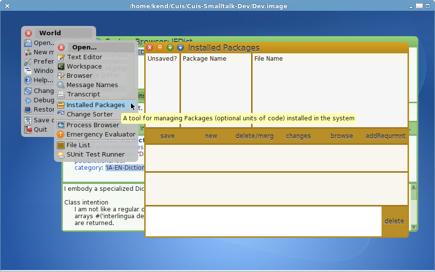

Clicking on the _new_ button, I fill in exactly the same name as I gave the system category: 'IA-EN-Dictionary'.  Copy/Paste from the class browser would work here as well.  I Accept the name.

Now I just fill in the package comment and click the 'save' button.

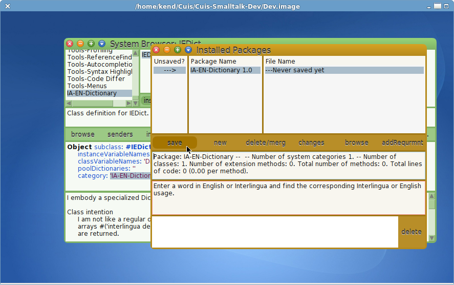

I can open a File Browser to check that the package was created.

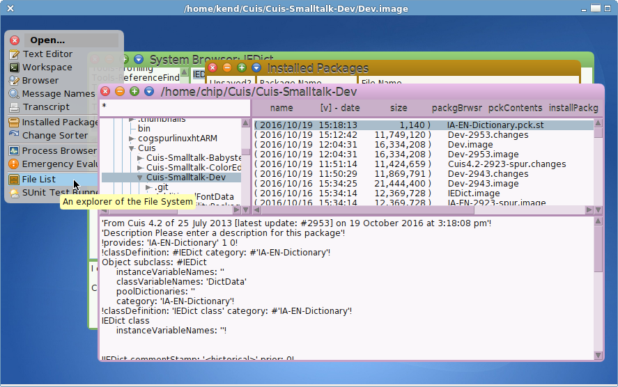

I find a file 'IA-EN-Dictionary.pck.st' was created in the directory where the Cuis image file was found 'Cuis-Smalltalk-Dev'.

This package text file contains the code and some _meta-data_ about the code and looks fine.  However, the package file is ***not*** in the 'Cuis-Smalltalk-IA-EN-Dictionary' directory.

Gotta fix this!

In my case, I get a Linux command shell, move the file to the Cuis-Smalltalk-IA-EN-Dictionary directory, "git add", "git commit", "git push".

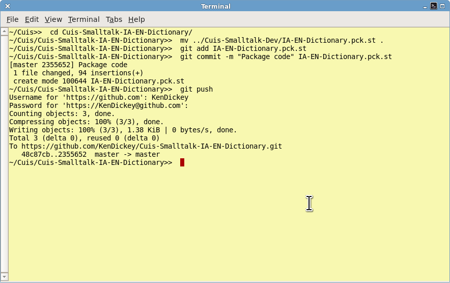

Our Cuis-Smalltalk-IA-EN-Dictionary repository on GitHub has now been updated to contain our package.

Anyone with access to this directory web page on GutHub can now "git clone" the directory and share our code, after which they can "git pull" to get our updates.

All that remains to do is quit out of Cuis WITHOUT saving our changes.

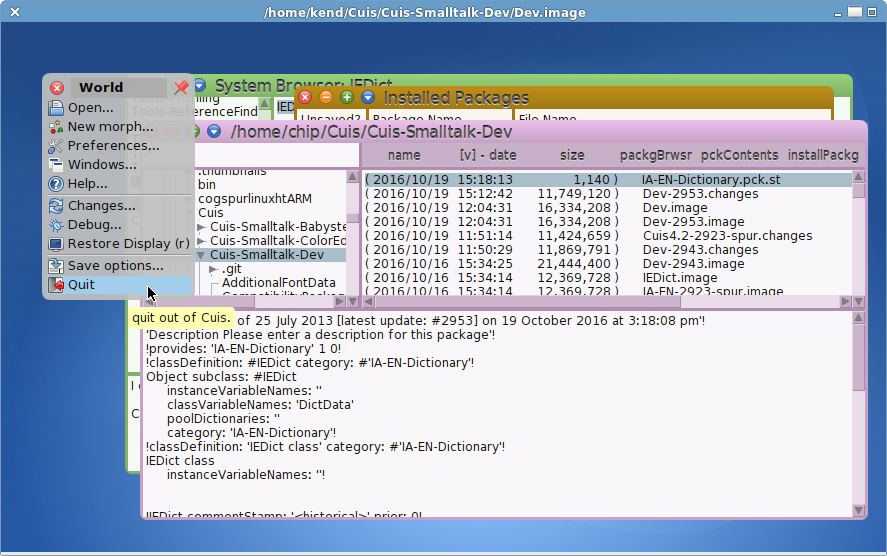
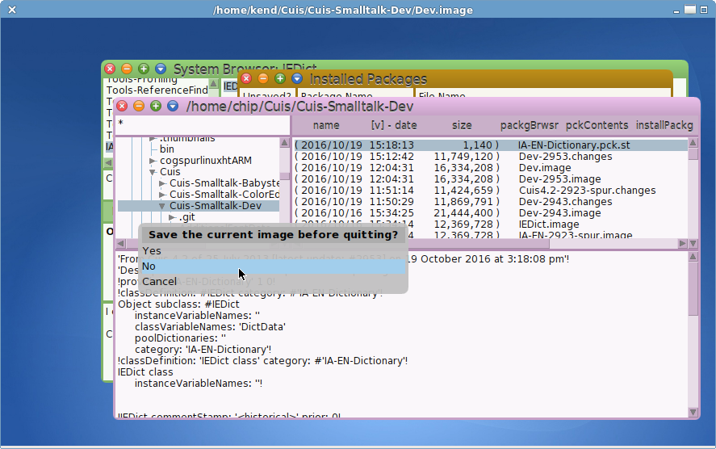

This is OK as we are not changing the base Cuise image.  All our work is saved in GitHub.

### Part 2

This tutorial is continued in
- https://github.com/Cuis-Smalltalk-Learning/Learning-Cuis/blob/master/SamplePackage2.md
