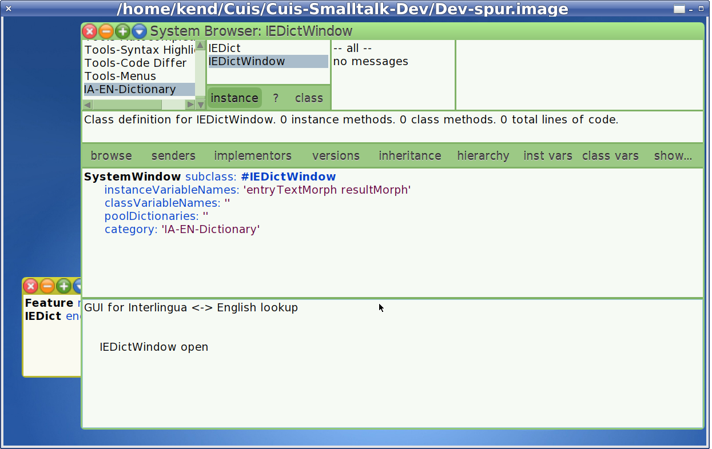
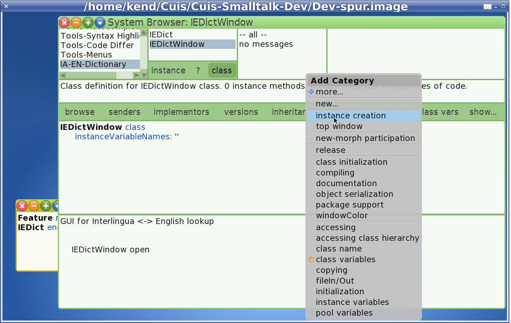
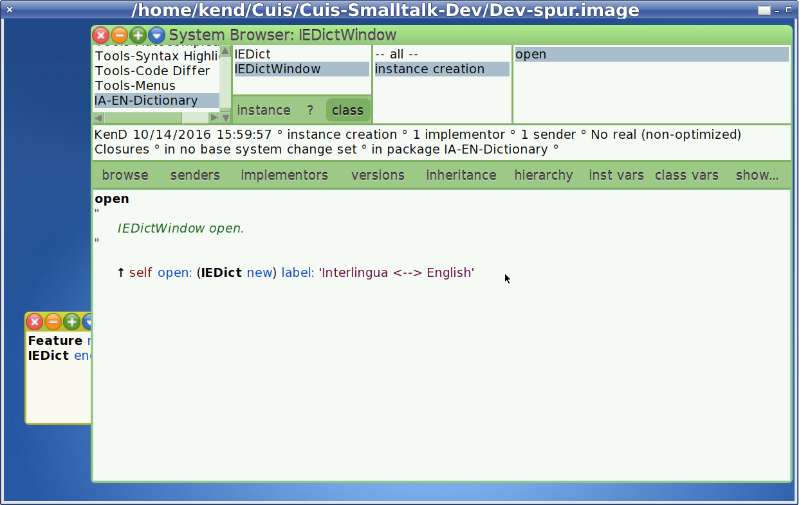
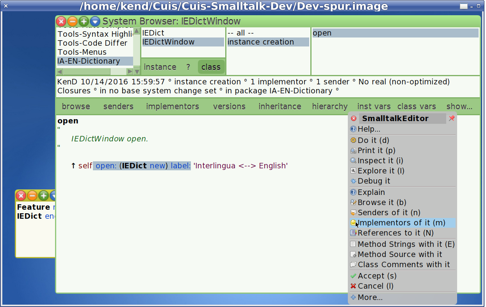
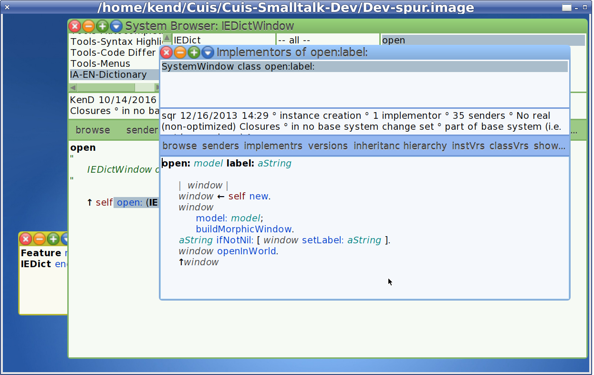
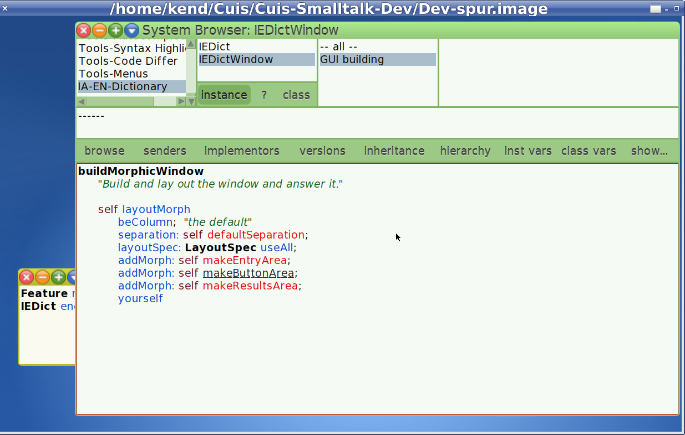

Making a Simple Package for Cuis -- Part 2
================================

This is a continuation of
- https://github.com/Cuis-Smalltalk-Learning/Learning-Cuis/blob/master/SamplePackage1.md

### Feature require: #'IA-EN-Dictionary'

We start with a "fresh" Cuis development image.

World menu -> Open -> Workspace

````Smalltalk
Feature require: #'IA-EN-Dictionary'
````

Note that Cuis does _syntax hilighting_ as you type.  Very useful, this.

- _Feature_ is the name of a class
- _require:_ is a message selector on the Feature class
- _#'IA-EN-Dictionary'_ is a _symbol_

You also have _word completion_.  If you start typing a word, e.g. 'Fea', then type TAB, you get a context based temporary select list of possible completions.

You can ignore these or select one of them and press enter/CR to complete the word you want.


In a Workspace you can select a line of code and either Cmd-click for the context menu and select DoIt or press Cmd-d to compile and run the code.

If the package loads, skip this paragraph and go to the next one.  First, make sure all words are spelled properly and try DoIt again.  Otherwise, you now need to learn how package code is searched for in Cuis. First, Cuis looks in the folder the image is running from, then in its subfolders/subdirectories 'Packages' and 'CompatibilityPackages'.  Then it looks in the parent directory of 'Cuis-Smalltalk-Dev' for directories with names starting 'Cuis-Smalltalk-'.  So the best thing is for all directories/folders named 'Cuis-Smalltalk-*' to be in the same common directory.  If this directory is named 'Cuis' then there should be a 'Cuis/Cuis-Smalltalk-Dev' and a 'Cuis/Cuis-Smalltalk-SamplePkg'.  If this is not the case, make it so and try again.  If there is still a problem, please ask on the Cuis mailing list http://cuis-smalltalk.org/mailman/listinfo/cuis-dev_cuis-smalltalk.org

After the package has been loaded, you should be able to open a code browser and select the category and the IEDict class.  You can also move the mouse to the class  category pane of the code browser, Cmd-click to get the context menu, select Find (or just Cmd-f) type 'IEDict' and you will get to the class code.


### Initializing the IEDict Class

In the Class pane, under 'IEDict' there are three buttons labled 'instance', '?', and 'class'.  Click on 'class'.


The difference between Class and Instance is that _instance methods_ operate on individual objects which are instances of a class.  _Class methods_ operate on the class code shared by all instances.  We'll get into what this means in a bit more detail below.

To keep things organized, the class browser groups methods into categories.  We will be adding code which does _class initialization_ so we first add this category.

Cmd-click on the method category pane to get its context menu and add a new method category.


Select the 'class initialization' category to get a _method template_.  

Note the syntax hilighting.  The _method selector_ is in black, _comments_ are in green, _temporaries_ are in grey, unknown words in red.


### Reading the Dict Data

The first thing we need to look up words in a dictionary is, of course, the dictionary.  Please open a File List browser and navigate to 'iedict.txt' to see what this text file looks like.  (Cmd-click on World; World->Open->File List).


There is a comment line which indicates the original source of the file, then lines like
- interlingua parolas : english words

Since we want a bidirectional lookup, let's save the data as an array of pairs.

As we only need to read the file once into memory and can share the data, an IEDict class variable is a good home for the data.

Here is one way of doing this.


The text file 'iedict.txt' is read from IEDict's package file name directory.  (Cuis' FileEntry differs from Squeak's DirectoryEntry by the way.  We think it is simpler to use.)

The comment line is skipped and each line is read in as a String which is split on the colon into two substrings which are stored sequentially in an Array which is available in IEDict's DictData class variable.

Now a class' #initialize method is invoked when a class is filed-in/loaded.  Since we have already created the class IEDict we need to invoke `IEDict>>initialize` ourselves.

Did I mention that I like to make things easy for myself?

You may have noticed the comment 
````Smalltalk
"
	IEDict initialize.
"
````
One can select any text in a code browser window and DoIt (Cmd-d).  When I am changing method code and may want to invoke the method again, I just add the invocation code as a comment so that I can DoIt without having to open a Workspace.


Well, without a visible change it is hard to see that `IEDict>>initialize` succeeded.  I could open an object explorer on the IEDict class object, but since we need lookup methods in any case, why not just write them and use them to be sure we read in the dictionary?

Did I tell you I was lazy?  ;^)

### Lookup

For lookup we use the `String>>match:` method.  This does "regular expression"  matching.

````Smalltalk
interlinguaContains: aString
	"Answer all definition pairs which contain aString looking in the Interlingua side"

	| matchStr |
	matchStr :=  ('*' , aString , '*' ) .
	
	^DictData select: [ :pairArray | matchStr match: (pairArray at: 1) ]
````

Lookup functions for our four buttons are just slight variations on the above.

Cmd-p (print) will show the result in a Workspace.


### Wash, rinse, repeat

Now is a good time to save our work.  (The power goes out here in winter in high winds, so I save my work frequently).

We need to 
- Save the Package
- "git commit"
- "git push"

You remember how to open the package browser and "save", right?

Here is the last time I will bore you with a non-Smalltalk screen shot


### IEDictWindow

OK.  Now to make a window to show our stuff.

How do we do this?

Well, there is a lot of good code in SystemWindow that we can reuse just by subclassing.  (Did I tell you I was lazy?)

The IEDictWindow needs to keep track of two things: the text query and the result.

These will be Morphs, graphical screen objects.



### Opening a IEDictWindow (a new instance)

We want to open a new IEDictWindow by asking its class to make one.

The first step is to add a method category to the class side



Now we add the code to create an instance



`IEDictWindow class>>open` uses the inherited method `SystemWindow class>>open:label:`

Let's take a brief look at this.  Select the text which contains `open:*label:` and Cmd-m (iMplementors).



Implementors shows just one implementor: SystemWindow.



The `SystemWindow class>>open:label:` method sets the window's _model_, invokes #buildMorphicWindow, sets the label (if any), and returns the window.

So our next task is to go to the _instance_ side of the class and implement `IEDictWindow>>buildMorphicWindow`.



..which we will do in Part 3 of this tutorial
- https://github.com/Cuis-Smalltalk-Learning/Learning-Cuis/blob/master/SamplePackage3.md
