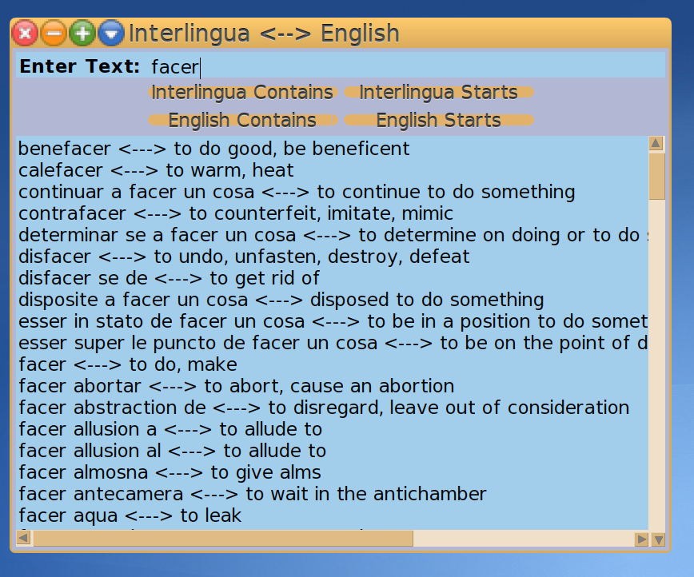
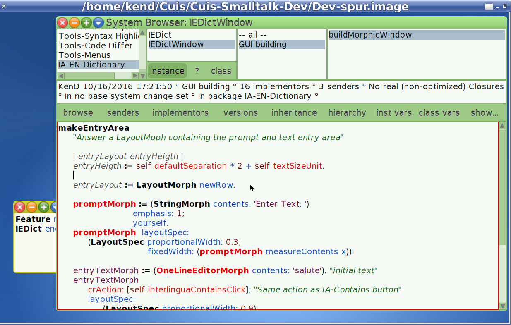
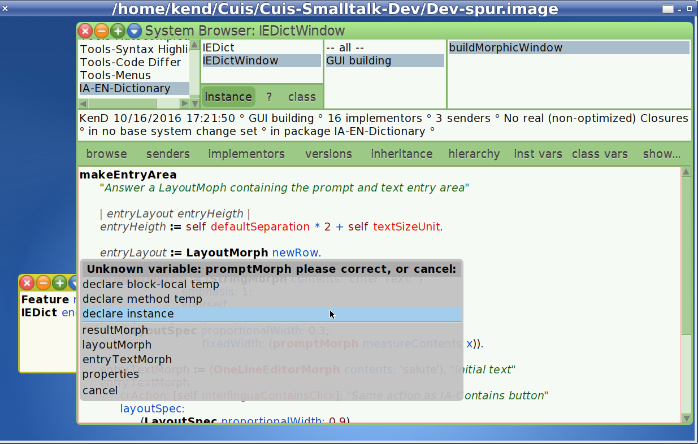

Making a Simple Package for Cuis -- Part 3
================================

This is a continuation of
- https://github.com/Cuis-Smalltalk-Learning/Learning-Cuis/blob/master/SamplePackage2.md

### Context

To review: 
- We are about to put together a SystemWindow.
- To do this we are writing the method IEDictWindow>>buildMorphicWindow
- The Window should look something like


We will use Layouts as described in the Layout Tutorial
- https://github.com/Cuis-Smalltalk-Learning/Learning-Cuis/blob/master/LayoutTour.md

### buildMorphicWindow

Looking at the desired result, I see a column of
- Prompt and Text Entry
- Buttons
- List of Results

So let's write this down.


Note that when I Accept this method, I get repeated warnings about undefined methods and options to change the text to known methods.

I just select the top line of the menu (the original text) to confirm that this is the choice I want.

OK.  Let's define all those methods.

### makeEntryArea

I'll start with the most complex one: `makeEntryArea`

The LayoutMorph returned is a row with the prompt ('Enter text: ') and a OneLineEditorMorph where the user can type words to be matched.

````Smalltalk
makeEntryArea
	"Answer a LayoutMoph containing the prompt and text entry area"
	
	| entryLayout entryHeigth |
	entryHeigth := self defaultSeparation * 2 + self textSizeUnit.
	
	entryLayout := LayoutMorph newRow.
	
	promptMorph := (StringMorph contents: 'Enter Text: ') 
					emphasis: AbstractFont boldCode; 
					yourself.
	promptMorph  layoutSpec: 
		(LayoutSpec fixedWidth: (promptMorph measureContents x)).
			
	entryTextMorph := (OneLineEditorMorph contents: 'salute'). "initial text"
	entryTextMorph 
		crAction: [self interlinguaContainsClick]; "Same action as IA-Contains button"
		layoutSpec: 
			(LayoutSpec proportionalWidth: 0.9).
			
	^ entryLayout 
		separation: self defaultSeparation;
		layoutSpec: (LayoutSpec proportionalWidth: 1 fixedHeight: entryHeigth);
		addMorph: promptMorph;
		addMorph: entryTextMorph;
		padding: #left
		yourself
````

The height of this LayoutMorph is calculated based on the text size.  One can change the text size via World menu-->Preferences-->Font Sizes.  Don't worry about this for now.  It takes some experinenting to get it right.  More on this later..

We have to set up how the window fields change when resized.  Part of this is by using LayoutSpec's.  We actually measure the size of the promptMorph's string to set this here.

We want the entryTextMorph to extend across the window and so we give it a proportional width of 0.9.  This means to take up 90% of the width of its layout.

We also set the `crAction` for the morph.  This code in invoked when the user types a carriage return / enter key.  As I said above, we want the same action as when a user clicks on the 'Interlingua Contains' button.

We want the prompt string to stick to the left of the layout, so we set the entryLayout's padding to `#left`.

We will see how this works when we actually build and return a window.

In the mean time, we need to Accept this code.

Here is what the text above looks like when pasted in the code editor (just select the buildMorphicWindow text with Cmd-a and replace).



When I Cmd-s (Accept), I find that I have some fixes to make.



I forgot to define `promptMorph` as an instance variable.

No worries.  I can select 'declare instance' and the code is added to the class definition for me.  Nice this!


Ah! The OneLineEditorMorph class is missing.

This is a more serious problem.

Time to bail out (cancel) and load the required code!


@@@
