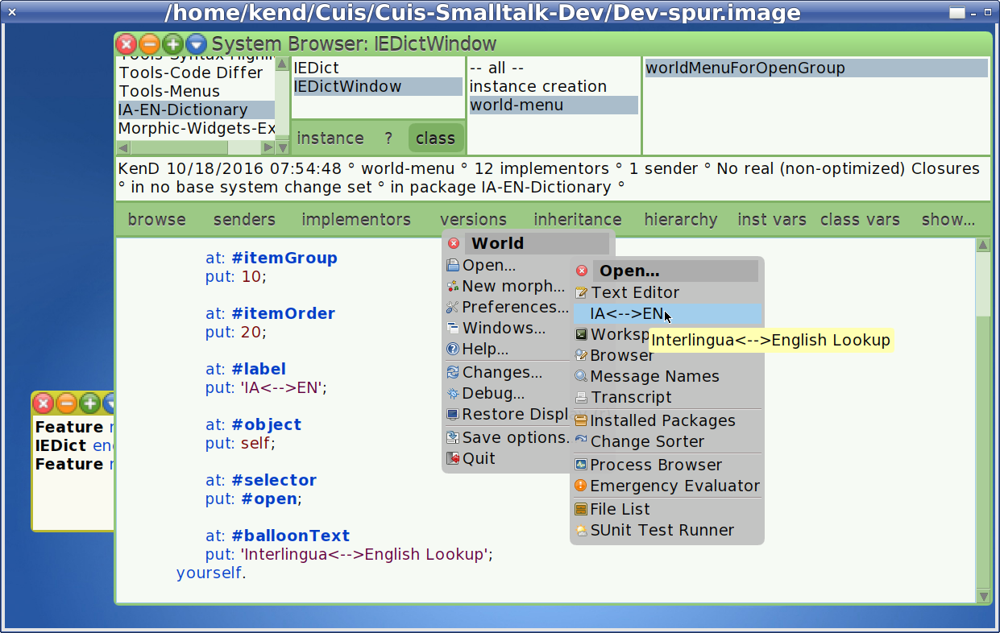
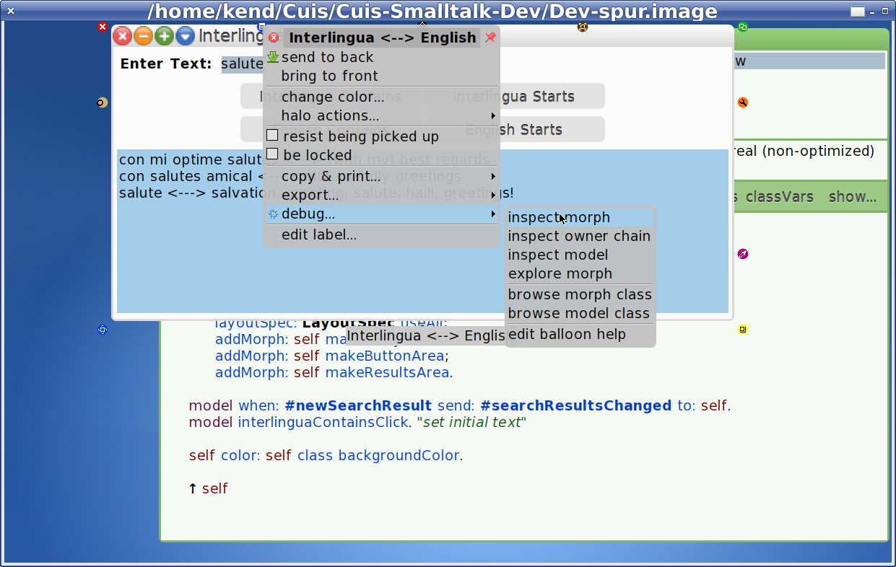
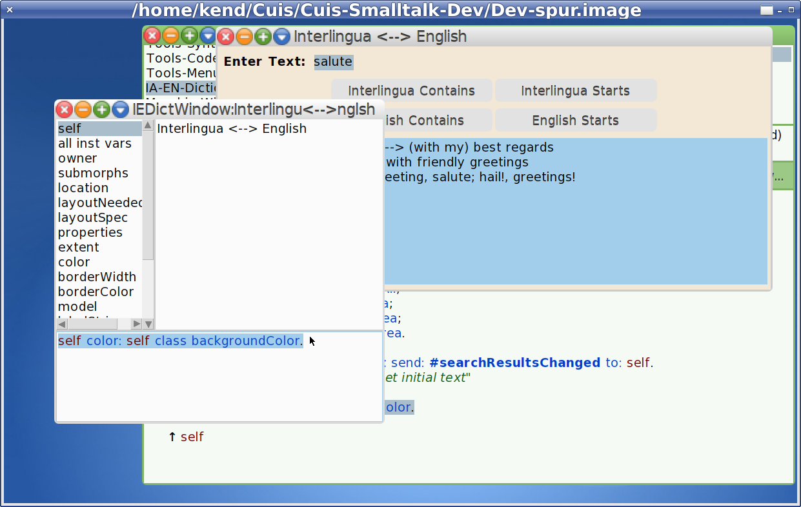
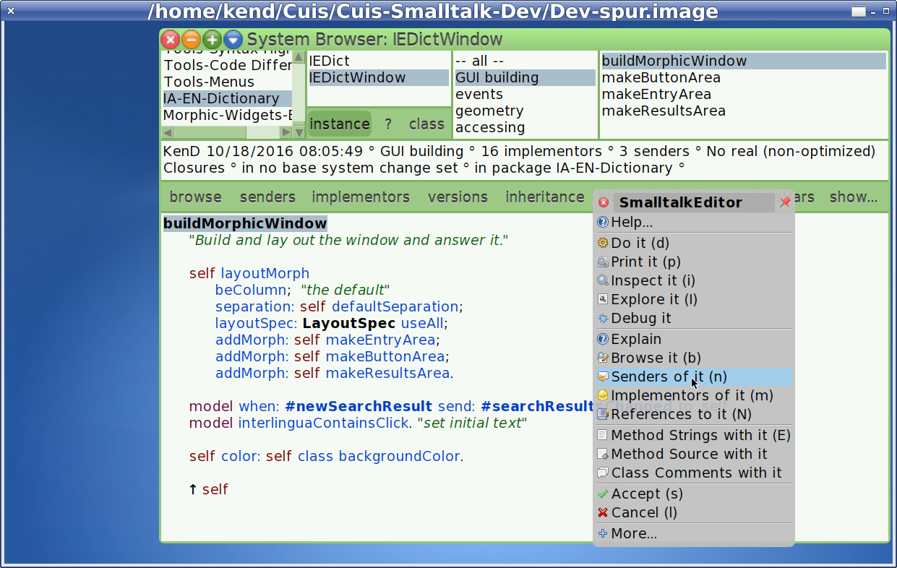
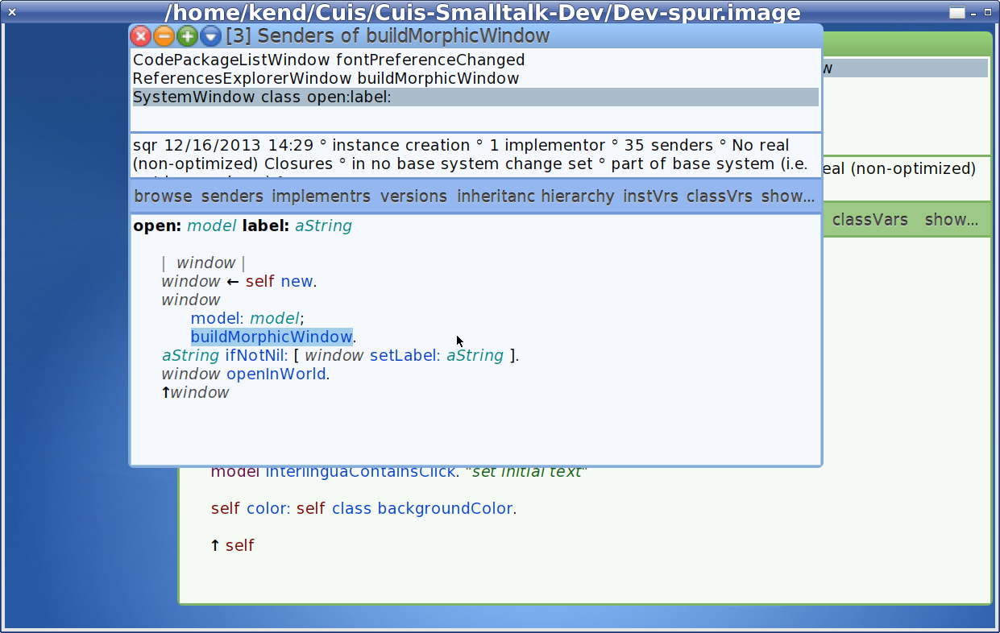
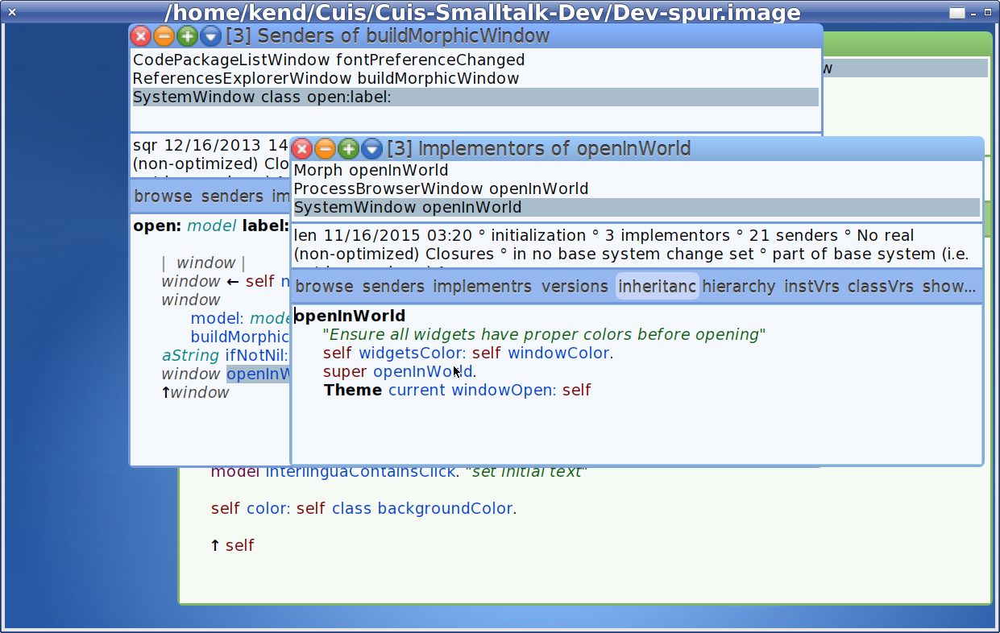
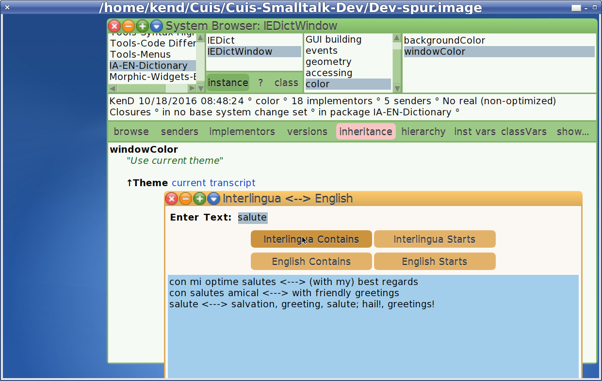

Making a Simple Package for Cuis -- Part 4
================================

This is a continuation of
- https://github.com/Cuis-Smalltalk-Learning/Learning-Cuis/blob/master/SamplePackage3.md

### Add to the World->Open menu

The next thing I am going to do is add a selection to the Open menu to open an IEDictWindow.  

There are several reasons for this.

For one thing, when one has dictionaries or other useful browsers it is good to have them available where they can be found.

ANother reason is that I keep opening an IEDictWindow and I want to make this easy.  Did I tell you I was lazy?  ;^)

Also, adding a menu item is easy.  Just add a method to the class side of your browser class.  In our case, IEDictWindow class.

````Smalltalk
worldMenuForOpenGroup
	"Answer the information required to add me to the World menu-->Open.. submenu"

	^ Dictionary new
		
			at: #itemGroup
			put: 10;
		
			at: #itemOrder
			put: 20;
		
			at: #label
			put: 'IA<-->EN';
		
			at: #object
			put: self;
		
			at: #selector
			put: #open;
		
			at: #balloonText
			put: 'Interlingua<-->English Lookup';
		yourself.
````




Hey, do I like easy!

### A bit of color

OK. Let's fix the color a bit.  I want a different background color.

I am going to write a method to return the background color so that I can try out a few different colors.

For IEDictWindow I create a method category `color` and add the method

````Smalltalk
backgroundColor

	^  Theme current transcript muchLighter
````

Then I set the window's background color in the instance side in method buildMorphicWindow.

````Smalltalk
buildMorphicWindow
	"Build and lay out the window and answer it."

	self layoutMorph 
		beColumn;  "the default"
		separation: self defaultSeparation;
		layoutSpec: LayoutSpec useAll;
		addMorph: self makeEntryArea;
		addMorph: self makeButtonArea;
		addMorph: self makeResultsArea.
		
	model when: #newSearchResult send: #searchResultsChanged to: self.
	model interlinguaContainsClick. "set initial text"
	
	self color: self backgroundColor.
	
	^ self
````

Now to open an new window from the Open menu and ...


Nothing happened?  Huh?

This just goes to show that we need to flexible and numble enough to deal with the unexpected.

Let's look around a bit.

I Cmd-click on the IEDictWindow morph and use its _menu handle_ to open an Inspector on it.

In the Workspace pane of the Inspector I type
````Smalltalk
self color: self backgroundColor.
````
Press Cmd-d (DoIt) and ...




The background color for the window is set as I expect.

So the color setting changed _after_ it was set in `buildMorphicWindow`.

Who is clobbering our color setting?

How do we solve this mystery? 

Let's see who is messaging/calling `buildMorphicWindow`.

Being lazy (did I tell you I was lazy?), I go back to the buildMorphicWindow method, select the name and Cmd-n (seNders of it).




I find that the `SystemWindow class>>open:label:` method
- creates a new window
- sets its model
- invokes `buildMorphicWindow`
- sets the window's label in the title bar
- opens it in the current world

Nothing wierd here.  

Let's look at implementors of `openInWorld`




Ah hah!  

SystemWindow's `openInWorld` is overriding Morph's `openInWorld` to fiddle with window colors.

We can override `SystemWindow>>windowColor` with our own color method
````Smalltalk
windowColor
	"Use current theme"
	
	^Theme current transcript 
````

Note: you can hilight `Theme`, Cmd-b (Browse the class) to look at various color selections.  Exploring a Color shows a small color swatch.  For Color details, look at various sets of named colors and the Color Editor.
- https://github.com/KenDickey/Cuis-Smalltalk-NamedColors
- https://github.com/KenDickey/Cuis-Smalltalk-ColorEditor


Trying this out...



This is starting to look pretty good.

Now, rather than change the `SystemWindow>>openInWorld` method, I am going to set some color values ***after*** `openInWorld` rather than before.

We can do this in `IEDictWindow class>>open`
````Smalltalk
open
"
	IEDictWindow open.
"
	| newSelf |
	newSelf := self open: (IEDict new) label: 'Interlingua <--> English'.
	"Override default color resets in SystemWindow>>openInWorld"
	newSelf color: newSelf backgroundColor.
	newSelf layoutMorph submorphs last "the text entry layout morph"
		color: (Theme current textHighlight lighter).
	^ newSelf
````

Open an new IEDictWindow and...


Super!!

Now we know we can play with colors to get whatever we want want.


### Font Resize


### Check Our Work

